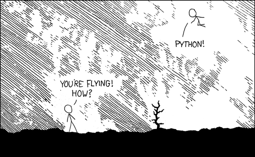

# Advanced Python
## for HPC

--

> I suggested holding a "Python Object Oriented Programming Seminar", but the acronym was unpopular.
>
> -- Joseph Strout

--

## Before we get started...

> *Advanced Python* is measured by homeomorphic endofunctors mapping submanifolds of a Hilbert space

* No detailed knowledge what you know <!-- .element: class="fragment" -->
* No detailed knowledge what you need <!-- .element: class="fragment" -->

    cdef class Course(Workshop):
        def __init__(self, students: Set[Any]):
            ...
 <!-- .element: class="fragment" -->

* ...inquire, intrude, interact as you see fit <!-- .element: class="fragment" -->

--

Source:
https://xkcd.com/353/
